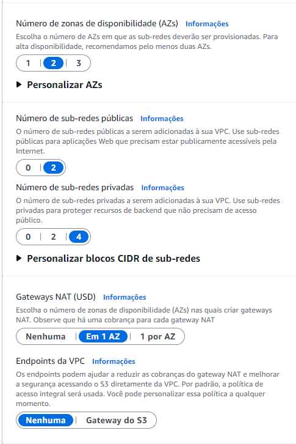
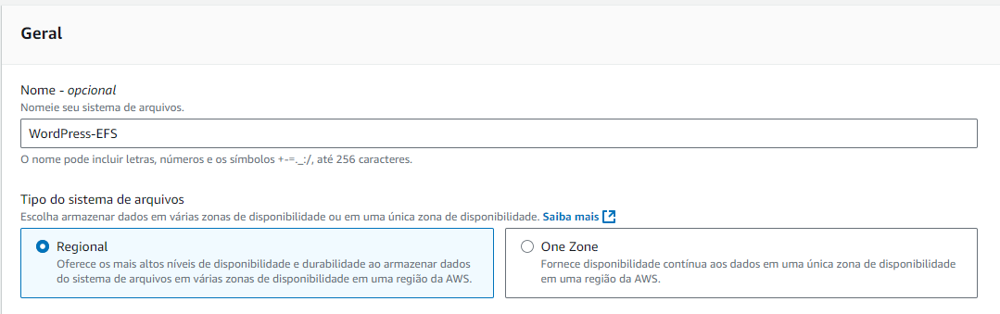
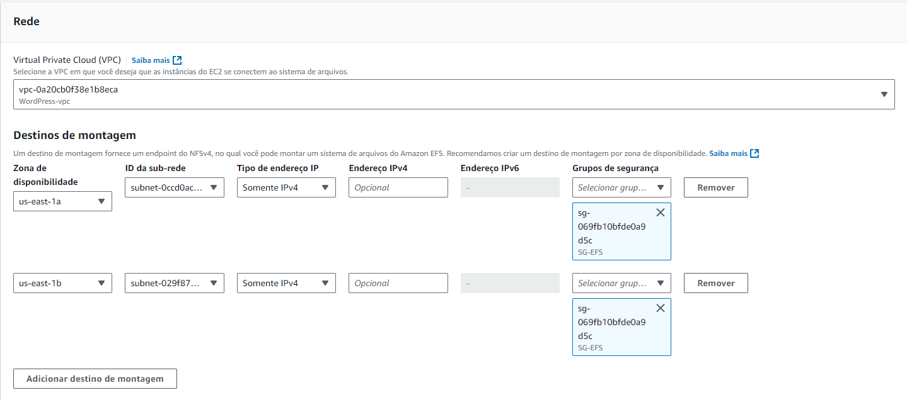

# Projeto WordPress em Alta Disponibilidade na AWS

## 📖 Descrição
Este projeto tem como objetivo implantar a plataforma **WordPress** na nuvem AWS de forma **escalável**, **tolerante a falhas** e **altamente disponível**.  
A arquitetura proposta utiliza serviços gerenciados da AWS para garantir **desempenho**, **resiliência** e **facilidade de manutenção**, simulando um ambiente de produção real.

## 🎯 Objetivos
- Desenvolver competências práticas em **Infraestrutura como Código**.
- Provisionar recursos de forma segura e escalável.
- Implementar arquitetura resiliente para aplicações web.
- Explorar serviços essenciais da **AWS** no contexto de alta disponibilidade.

## 🏗 Arquitetura
A solução é composta por:
- **VPC personalizada** com subnets públicas e privadas.
- **Amazon RDS** (MySQL/MariaDB) para banco de dados relacional.
- **Amazon EFS** para armazenamento compartilhado.
- **Auto Scaling Group (ASG)** para instâncias EC2.
- **Application Load Balancer (ALB)** para balanceamento de carga.
- Configuração de **Security Groups** e permissões adequadas.

**Fluxo da Arquitetura:**
1. O tráfego chega ao **ALB** (subnets públicas).
2. O ALB distribui requisições para as instâncias EC2 (subnets privadas).
3. As instâncias acessam o banco de dados no **RDS** e arquivos no **EFS**.
4. O **ASG** escala automaticamente com base no uso de CPU.

## 🛠 Serviços AWS Utilizados
- **Amazon VPC**: 2 subnets públicas, 4 privadas, IGW e NAT Gateway.
- **Amazon EC2**: instâncias para rodar o WordPress.
- **Amazon RDS**: instância Multi-AZ (quando permitido) para banco de dados.
- **Amazon EFS**: sistema de arquivos compartilhado.
- **Application Load Balancer (ALB)**: balanceamento de tráfego HTTP.
- **Auto Scaling Group (ASG)**: ajuste automático de capacidade.
- **AWS CloudWatch** (opcional): monitoramento de métricas.

## 📋 Etapas de Implementação
1. **Conhecer o WordPress localmente**
   - Executar via Docker Compose: [Imagem Oficial](https://hub.docker.com/_/wordpress)
2. **Criar a VPC**
   - Subnets públicas e privadas
   - IGW e NAT Gateway
   

2. **Criar a Security Groups**
   - SG-ALB : 
    - entrada: HTTP(Qualquer) / saída: HTTP (SG-EC2)
   - SG-EC2 : 
    - entrada: HTTP(SG-ALB),MYSQL(SG-RDS) / saída: Todo Tráfego(Qualquer), MYSQL(Qualquer),HTTP(Qualquer),NFS(QUALQUER)
   - SG-RDS : 
    - entrada: MYSQL (SG-EC2) / saída: MYSQL (SG-EC2)
   - SG-NFS : 
    - entrada: NFS (SG-EC2) / saída: NFS (SG-EC2)

3. **Criar o RDS**
   - Banco MySQL
   - Free Tier
   - db.t3.micro
   - Coloque na sua VPC
   - Selecione security group criado RDS
   - E em configurações adicionios coloque o mesmo nome do indentificador
   
4. **Criar o EFS**
   - Na aba de EFS crie um novo e vá em personalizar
    
   - Configure nas sub redes privada 3 e 4 da sua VPC
    

5. **Criar o Launch Template**
   - Criar amazon linux
   - t2.micro
   - Script [`USERDATA.sh`](./USERDATA.sh) para instalar WordPress, montar EFS e conectar ao RDS(Use o meu caso necessário)
6. **Configurar o Grupo de destino**
    

7. **Criar o Application Load Balancer**
   - Associar subnets públicas e associar ao grupo de destino
   

8. **Configurar o Auto Scaling Group**
   - Utilizar a imagem criada
   - Associar ao ALB
   - Definir 2 como o desejado 
   - 2 como o mínimo
   - 4 como máximo 

9. **Se tudo ocorreu bem**
    

## ⚠️ Observações Importantes
- As contas AWS de estudo possuem **restrições**:  
  - Instâncias EC2 devem conter tags se necessário
  - Caso necessário reiniciar as instâncias pode resolver alguns problemas de login
   
---

✍️ **Autor:** Dyego Dasko
