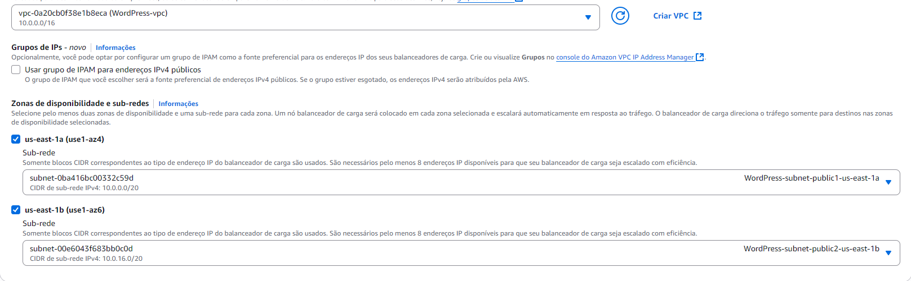
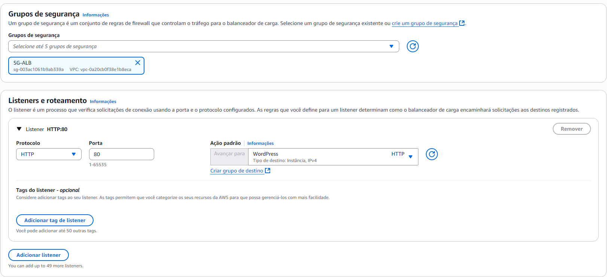

# Projeto WordPress em Alta Disponibilidade na AWS

## 📖 Descrição
Este projeto tem como objetivo implantar a plataforma **WordPress** na nuvem AWS de forma **escalável**, **tolerante a falhas** e **altamente disponível**.  
A arquitetura proposta utiliza serviços gerenciados da AWS para garantir **desempenho**, **resiliência** e **facilidade de manutenção**, simulando um ambiente de produção real.

## 🎯 Objetivos
- Desenvolver competências práticas em **Infraestrutura como Código**.
- Provisionar recursos de forma segura e escalável.
- Implementar arquitetura resiliente para aplicações web.
- Explorar serviços essenciais da **AWS** no contexto de alta disponibilidade.

## 🏗 Arquitetura
A solução é composta por:
- **VPC personalizada** com subnets públicas e privadas.
- **Amazon RDS** (MySQL/MariaDB) para banco de dados relacional.
- **Amazon EFS** para armazenamento compartilhado.
- **Auto Scaling Group (ASG)** para instâncias EC2.
- **Application Load Balancer (ALB)** para balanceamento de carga.
- Configuração de **Security Groups** e permissões adequadas.

**Fluxo da Arquitetura:**
1. O tráfego chega ao **ALB** (subnets públicas).
2. O ALB distribui requisições para as instâncias EC2 (subnets privadas).
3. As instâncias acessam o banco de dados no **RDS** e arquivos no **EFS**.
4. O **ASG** escala automaticamente com base no uso de CPU.

## 🛠 Serviços AWS Utilizados
- **Amazon VPC**: 2 subnets públicas, 4 privadas, IGW e NAT Gateway.
- **Amazon EC2**: instâncias para rodar o WordPress.
- **Amazon RDS**: instância Multi-AZ (quando permitido) para banco de dados.
- **Amazon EFS**: sistema de arquivos compartilhado.
- **Application Load Balancer (ALB)**: balanceamento de tráfego HTTP.
- **Auto Scaling Group (ASG)**: ajuste automático de capacidade.
- **AWS CloudWatch** (opcional): monitoramento de métricas.

## 📋 Etapas de Implementação

### 1. Conhecer o WordPress localmente
- Executar via Docker Compose: [Imagem Oficial](https://hub.docker.com/_/wordpress)

---

### 2. Criar a VPC
- Criar subnets públicas e privadas.
- Configurar IGW e NAT Gateway.

---

### 3. Criar os Security Groups
- **SG-ALB**  
  - Entrada: HTTP (Qualquer)  
  - Saída: HTTP (SG-EC2)

- **SG-EC2**  
  - Entrada: HTTP (SG-ALB), MySQL (SG-RDS)  
  - Saída: Todo tráfego (Qualquer), MySQL (Qualquer), HTTP (Qualquer), NFS (Qualquer)

- **SG-RDS**  
  - Entrada: MySQL (SG-EC2)  
  - Saída: MySQL (SG-EC2)

- **SG-NFS**  
  - Entrada: NFS (SG-EC2)  
  - Saída: NFS (SG-EC2)

---

### 4. Criar o RDS
- Banco MySQL  
- Free Tier  
- Tipo: `db.t3.micro`  
- Associar à VPC  
- Selecionar o Security Group do RDS  
- Em configurações adicionais, usar o mesmo nome do identificador

---

### 5. Criar o EFS
- Na aba de EFS, criar um novo e selecionar **personalizar**.

- Configurar nas subnets privadas 3 e 4 da VPC.

- Configurar o Security group do EFS
---

### 6. Criar o Launch Template
- Sistema operacional: Amazon Linux  
- Tipo: `t2.micro`  
- Security group das EC2
- Sua VPC sem especificar sub nets
- Adicionar script [`USERDATA.sh`](./USERDATA.sh) para:
  - Instalar WordPress
  - Montar EFS
  - Conectar ao RDS

---

### 7. Configurar o Target Group
- Instances

- Health check path: / ou /wp-admin/images/wordpress-logo.svg

---

### 8. Criar o Application Load Balancer
- Associar às subnets públicas
- Direcionar para o Target Group

---

### 9. Configurar o Auto Scaling Group
- Usar a imagem criada
- Associar ao ALB
- Definir:
  - **Desejado**: 2
  - **Mínimo**: 2
  - **Máximo**: 4

---

### 10. Resultado Final
Se tudo ocorrer corretamente:

---

## ⚠️ Observações Importantes
- Contas AWS de estudo possuem **restrições**:  
  - Instâncias EC2 devem conter tags obrigatórias (caso necessário).  
- Sempre **excluir recursos** após finalizar para evitar custos indesejados.
- Reiniciar instâncias pode resolver problemas de login.

---

✍️ **Autor:** Dyego Dasko
